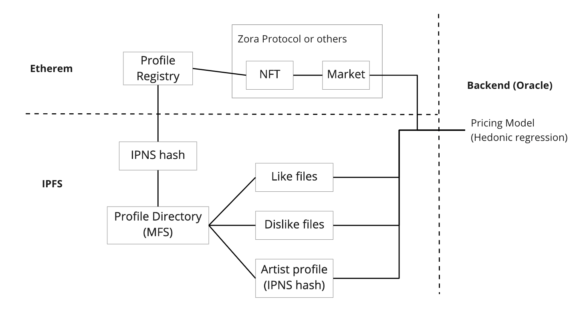

# Like2Price

Like2Price is a tool for estimating the price of NFT arts using online reputation metrics, including likes, dislikes, follows.

## What is this?

> The future of collecting may be less in owning the thing that nobody else has, and more in owning the thing that everybody has.
> -- McKenzie Wark, 2016

When we realize the value of NFT comes from the community, we share them more for increasing their value. But how do we know how much value can be created through sharing? Or speaking in another way, how much money are people willing to pay for what has many likes?

This project is a tool for estimating the price of NFT arts based on how many like counts or dislike counts the art has. So we are doing two things in these project:
- Store these reputation data into IPFS, which means the reputation is returned back to the artwork itself instead of being bound on the social media platform.
- Estimating the price of NFT arts using these reputation data, which means the community can have reference prices to make more wise decisions.

## How it works?

This project use IPFS to store the reputation data, including like count, dislike count, and so forth. Every NFT art will have an IPNS hash that is represented as the community profile of the art. The IPNS hash is recorded on Ethereum. Each reputation file is signed by users, which means the like can be verifiable.

This project is integrated with Zora protocol, which consists of media and market contracts. And the estimated price is calculated by both reputation data on IPFS and history quote on Ethereum using Hedonic regression.

Hedonic regression is the use of a regression model to estimate the influence that various factors have on the price of a good, or sometimes the demand for a good.

## Teams

- [@Xiawpohr](https://github.com/Xiawpohr)
- [@mavisliu689](https://github.com/mavisliu689)
- [@sunaley](https://github.com/adam-p/markdown-here/wiki/Markdown-Cheatsheet#images)
- Janice
